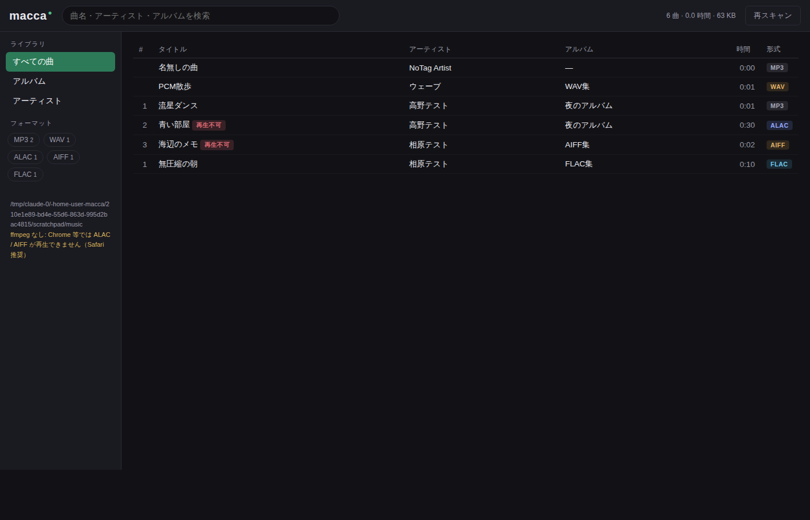
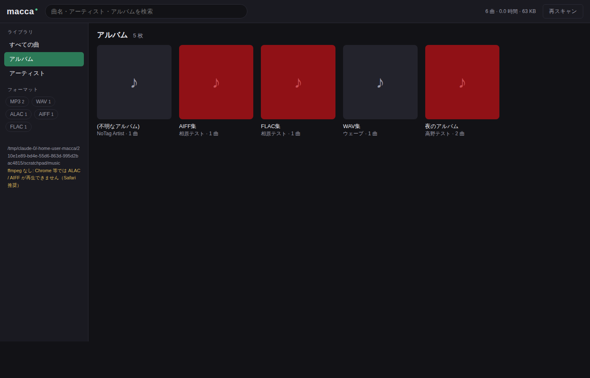

# macca

**iTunes（Apple Music アプリ）を使わずに、ローカルの音楽ファイルを管理・再生する Web アプリ。**

mp3 / AIFF / ALAC (m4a) / AAC / FLAC / WAV の入ったフォルダを指定してサーバを起動するだけで、
ブラウザからライブラリの閲覧・検索・再生ができます。
**依存パッケージゼロ**（Node.js 標準ライブラリのみ）で、`npm install` 不要。
ファイルには一切書き込まず読み取り専用で動くので、既存のライブラリを壊す心配がありません。



## 背景

Apple 純正アプリでローカルファイルとサブスクを同時に管理するのは厳しい
（iTunes Match の同期でファイルが壊れる、非圧縮・可逆音源が数百 GB あると管理不能）
という問題意識から作られています。

- **ライブラリの実体はただのフォルダ構成**。macca はそれをスキャンして表示するだけで、
  独自データベースにファイルを取り込んだり移動したりしません
- Apple 純正アプリはサブスク再生専用と割り切り、手元のファイルは macca（または後述の代替アプリ）で管理する運用を想定しています

## 使い方

Node.js 18 以上があれば動きます（macOS / Linux / Windows）。

```sh
git clone https://github.com/koshikawa-masato/macca.git
cd macca
node server.js ~/Music/MyLibrary
```

起動したら `http://127.0.0.1:8323/` をブラウザで開くだけです。

```
使い方: node server.js <音楽ディレクトリ> [--port 8323] [--host 127.0.0.1] [--no-cache]
```

- 初回スキャン結果は `~/.cache/macca/` にキャッシュされ、2 回目以降の起動は高速です
  （ファイルの更新日時・サイズが変わったものだけ再読み込み）
- `--host 0.0.0.0` にすると同じ LAN 内のスマホなどからも聴けます
  （認証はないので、信頼できるネットワーク内でのみ使ってください）

### ブラウザと再生形式について

| 形式 | Safari | Chrome / Edge / Firefox |
|------|--------|--------------------------|
| MP3 / AAC / WAV | ○ | ○ |
| FLAC | ○ | ○ |
| **ALAC (m4a)** | ○ | ✕（ffmpeg があれば ○） |
| **AIFF** | ○ | ✕（ffmpeg があれば ○） |

ALAC と AIFF をネイティブ再生できるのは Safari だけです。それ以外のブラウザで聴く場合、
サーバマシンに [ffmpeg](https://ffmpeg.org/)（`brew install ffmpeg`）が入っていれば、
macca がその場で **WAV にロスレス変換**してストリーミングします（元ファイルは変更しません）。

## 機能



- 曲・アルバム・アーティストの 3 ビュー、インクリメンタル検索、列ソート
- フォーマット別フィルタ（MP3 / ALAC / AIFF / FLAC …）— 「非圧縮のものだけ聴きたい」に対応
- 埋め込みアートワーク表示（ID3 APIC / MP4 covr / FLAC PICTURE）、
  なければフォルダ内の `cover.jpg` / `folder.jpg` 等にフォールバック
- シャッフル・リピート・キーボード操作（Space で再生/停止）・OS のメディアキー対応
- 文字化け対策: エンコーディング宣言が壊れたタグ（Latin-1 と偽った Shift_JIS / UTF-8）を推定してデコード

### 対応メタデータ

すべて自前実装のパーサで、ファイルの必要な部分だけを読みます（240GB のライブラリでも全ファイル読み込みはしません）。

| 形式 | コンテナ | 読むもの |
|------|----------|----------|
| .mp3 | ID3v2.2 / 2.3 / 2.4 | タイトル・アーティスト・アルバム・トラック番号・年・ジャンル・アートワーク、Xing/CBR による再生時間推定 |
| .m4a | MP4 (iTunes 形式 ilst) | 同上 + コーデック判別（ALAC / AAC） |
| .aiff / .aif | IFF (COMM / ID3 チャンク) | 同上 + 正確な再生時間 |
| .flac | Vorbis Comment / PICTURE | 同上 |
| .wav | RIFF (LIST INFO / id3) | 同上 |

タグがないファイルは「`アーティスト - タイトル.mp3`」形式のファイル名から推定します。

## 開発

```sh
npm test        # Node 標準の node:test で 12 テスト（外部依存なし）
```

テストは合成した mp3 / m4a (ALAC) / AIFF / FLAC / WAV フィクスチャを生成して、
パーサと HTTP API（Range リクエスト・アートワーク配信・パストラバーサル拒否）を検証します。

```
server.js          HTTP サーバ (ストリーミング / API / 静的配信)
lib/
  scan.js          ライブラリスキャン + キャッシュ
  metadata.js      拡張子ごとのディスパッチ
  id3.js           ID3v2 パーサ
  mp3.js           MP3 再生時間推定
  mp4.js           MP4/M4A (ALAC/AAC) パーサ
  flac.js          FLAC パーサ
  aiff.js          AIFF パーサ
  wav.js           WAV パーサ
public/            フロントエンド (素の HTML/CSS/JS)
test/              フィクスチャ生成 + テスト
```

## 既製品という選択肢

自分でホストするより既製アプリが合う場合の代表例:

- **[Swinsian](https://swinsian.com/)** (macOS・有料) — iTunes 代替のド定番。大規模ライブラリに強い
- **[foobar2000](https://www.foobar2000.org/)** (Windows/macOS・無料) — 老舗。プラグインで何でもできる
- **[Doppler](https://brushedtype.co/doppler/)** (macOS/iOS・有料) — モダン UI のローカル再生専用
- **[Navidrome](https://www.navidrome.org/)** / **[Jellyfin](https://jellyfin.org/)** (セルフホスト・無料) — 常時起動サーバがあるなら。外出先からも聴ける
- **[Plexamp](https://www.plex.tv/plexamp/)** (Plex Pass) — セルフホスト系で音質・UI とも完成度が高い
- **[beets](https://beets.io/)** (CLI・無料) — タグ整理・リネームの自動化に

macca はこれらと違い「インストール不要・データベース不要・ファイル非破壊」を重視した最小構成です。

## ロードマップ

- [ ] プレイリスト（M3U 読み書き）
- [ ] ギャップレス再生
- [ ] タグ編集
- [ ] Ogg Vorbis / Opus のメタデータパース（再生は対応済み）

## ライセンス

MIT
